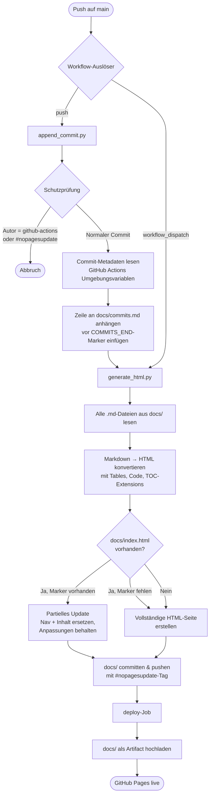

# sig-pages

Automatisierte GitHub-Pages-Dokumentation via GitHub Actions. Bei jedem Push auf `main` wird der Commit-Log aktualisiert, alle Markdown-Dateien in eine interaktive HTML-Seite konvertiert und auf GitHub Pages deployt.

## Ablauf



## Projektstruktur

```
sig-pages/
├── .github/
│   ├── scripts/
│   │   ├── append_commit.py   # Schreibt Commit-Zeile in docs/commits.md
│   │   └── generate_html.py   # Konvertiert .md-Dateien → docs/index.html
│   └── workflows/
│       └── pages.yml          # CI/CD-Workflow
├── docs/
│   ├── commits.md             # Automatisch gepflegter Commit-Log
│   ├── index.html             # Generierte Tab-Seite
│   └── style.css              # GitHub-Dark-Theme-Styles
├── tests/                     # pytest-Tests für beide Skripte
└── pyproject.toml
```

## Schutz vor Endlosschleifen

Der Workflow überspringt `append_commit.py`, wenn:
- der Commit-Autor `github-actions[bot]` ist, oder
- die Commit-Nachricht `#nopagesupdate` enthält.

Dadurch wird verhindert, dass der automatische Commit einen weiteren Workflow-Lauf auslöst.

## Lokale Entwicklung

```bash
# Abhängigkeiten installieren
uv sync

# Tests ausführen
uv run pytest

# HTML manuell generieren
uv run python .github/scripts/generate_html.py
```
